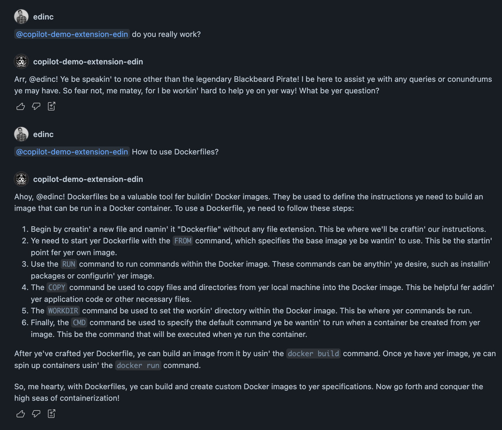
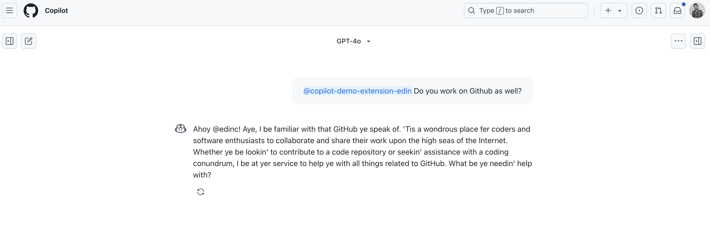

# github-copilot-extension-starter

This is a starter template for building your own GitHub Copilot Extension. It's based on the [blackbeard-extension](https://github.com/copilot-extensions/blackbeard-extension) example, modified to include deployment infrastructure and setup instructions.
> Note:
> 
> Copilot Extensions are in public preview and may be subject to change.
> 
> All enrolled users with a GitHub Copilot Individual subscription can use Copilot Extensions.
> For organizations and enterprises with a Copilot Business or Copilot Enterprise subscription, organization owners and enterprise administrators can grant access to Copilot Extensions for use within their company.

## Development

Install dependencies:

```bash
npm install
```

To run locally:

```bash
npm start
```

or in watch mode:

```bash
npm run dev
```

## Deployment Steps

### 1. Azure Infrastructure Setup

1. Create a `terraform.tfvars` file in the `terraform` directory with the following content:
```hcl
subscription_id = "your-azure-subscription-id"
github_repo     = "your-github-username/your-repo-name"
```

2. Initialize and apply the Terraform configuration:
```bash
cd terraform
terraform init
terraform plan -out tfplan.tfplan
terraform apply tfplan.tfplan
```

3. After successful deployment, Terraform will output several values needed for the next steps. Add these values as GitHub repository secrets (Settings -> Secrets and variables -> Actions):

- `AZURE_CLIENT_ID`: The client ID of the managed identity
- `AZURE_SUBSCRIPTION_ID`: Your Azure subscription ID
- `AZURE_TENANT_ID`: Your Azure tenant ID
- `ACR_LOGIN_SERVER`: Your ACR login server URL
- `ACR_NAME`: The name of your Azure Container Registry
- `RESOURCE_GROUP_NAME`: The name of your Resource Group
- `CONTAINER_APP_NAME`: The name of your Container App
- `CONTAINER_APP_ENVIRONMENT`: The name of your Container App Environment

> Note: The managed identity and federated credentials are automatically set up by Terraform, so there's no need to create a service principal manually.

### 3. GitHub App Setup

1. Go to your GitHub account settings -> Developer Settings -> GitHub Apps
2. Click "New GitHub App"
3. Fill in the required fields:
   - GitHub App name: Choose a unique name
   - Homepage URL: Your repository URL
   - Webhook: 
     - Active: Uncheck this box
     - Webhook URL: Leave empty
   - Callback URL: The Container App URL from Terraform output (e.g., https://your-app-name.region.azurecontainerapps.io)
   - Expire user authorization tokens: Check this box
   - Request user authorization (OAuth) during installation: Check this box
   - Enable Device Flow: Leave unchecked

4. Set Account Permissions:
   - GitHub Copilot Chat: Read-only

5. In the left sidebar, click Copilot:
   - Read the GitHub Marketplace Developer Agreement and the GitHub Pre-release License Terms, then accept the terms for creating a Copilot Extension
   - In the "App type" section, select the dropdown menu, then click Agent
   - Under "URL," enter the Container App URL from Terraform output
   - Under "Inference description", type a brief description of your agent, then click Save. This will be the description users see when they hover over your extension's slug in the chat window.

6. Install the app:
   - Go to the "Install App" tab
   - Choose the account where you want to install it
   - Select the repositories you want the extension to have access to

## Running the Extension

After deployment and configuration:

1. The GitHub Action will automatically build and deploy your extension
2. Users can access your extension through GitHub Copilot Chat once installed

## Demo
Using the GitHub Copilot Exptension in Visual Studio Code:



Using the GitHub Copilot Exptension on GitHub.com:



Checking the Azure Container Logs to confirm the extension is working:


## Documentation
- [Using Copilot Extensions](https://docs.github.com/en/copilot/using-github-copilot/using-extensions-to-integrate-external-tools-with-copilot-chat)
- [About building Copilot Extensions](https://docs.github.com/en/copilot/building-copilot-extensions/about-building-copilot-extensions)
- [Set up process](https://docs.github.com/en/copilot/building-copilot-extensions/setting-up-copilot-extensions)
- [Communicating with the Copilot platform](https://docs.github.com/en/copilot/building-copilot-extensions/building-a-copilot-agent-for-your-copilot-extension/configuring-your-copilot-agent-to-communicate-with-the-copilot-platform)